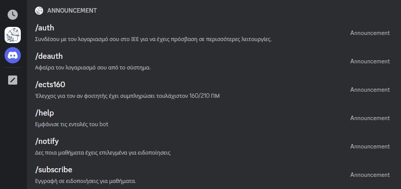
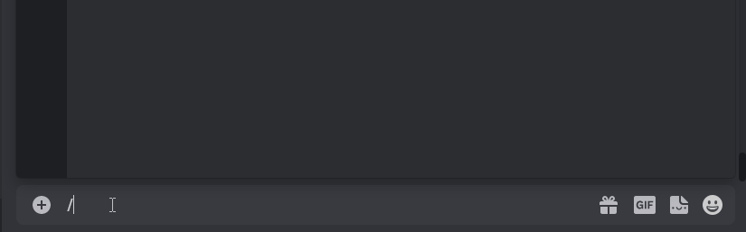
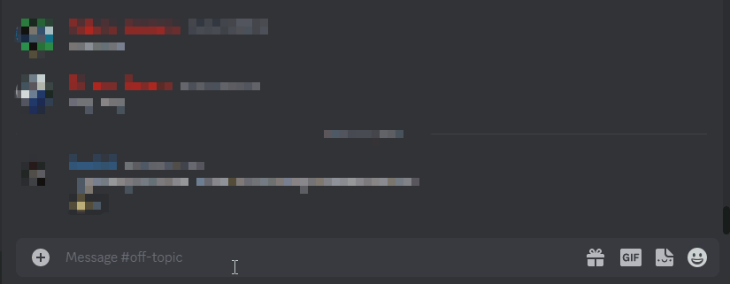
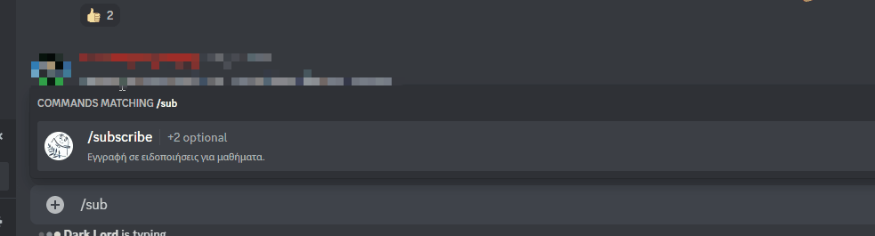
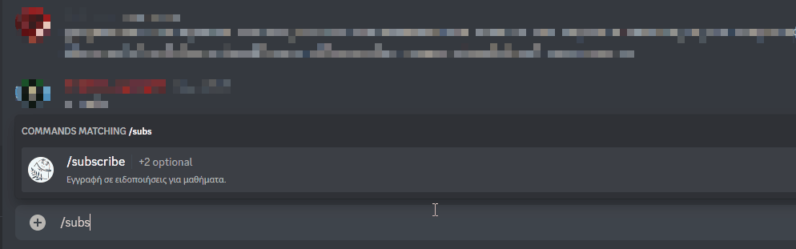
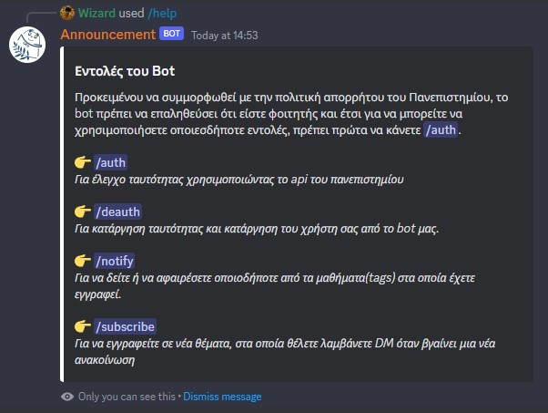

 

  

<h3 align="center">Command Usage</h3>

  

___

 
<h3 style="text-align: center;">👉/auth</h3>

  
  
In order to comply with the University's privacy policy, the bot must verify that you are a student in order to use any commands.

 

___

 
<h3 style="text-align: center;">👉/deauth</h3>

  
  
To de-identify and remove your user from our bot.

 

___

 
<h3 style="text-align: center;">👉/ects160</h3>

  
Not yet implemented

 

___

 
<h3 style="text-align: center;">👉/notify</h3>

  
  
To view or remove any of the courses (tags) you are enrolled in.

 

___

 
<h3 style="text-align: center;">👉/subscribe</h3>

    <table border="0">
    <tr>
        <td><b style="font-size:30px">Command with parameters</b></td>
        <td><b style="font-size:30px">Command without parameters</b></td>
    </tr>
    <tr>
        <td></td>
        <td></td>
    </tr>
    </table>
    
To subscribe to new subject, you want to receive a DM when a new announcement comes out

 

___

 
<h3 style="text-align: center;">👉/help</h3>

  
  
Show all available commands

